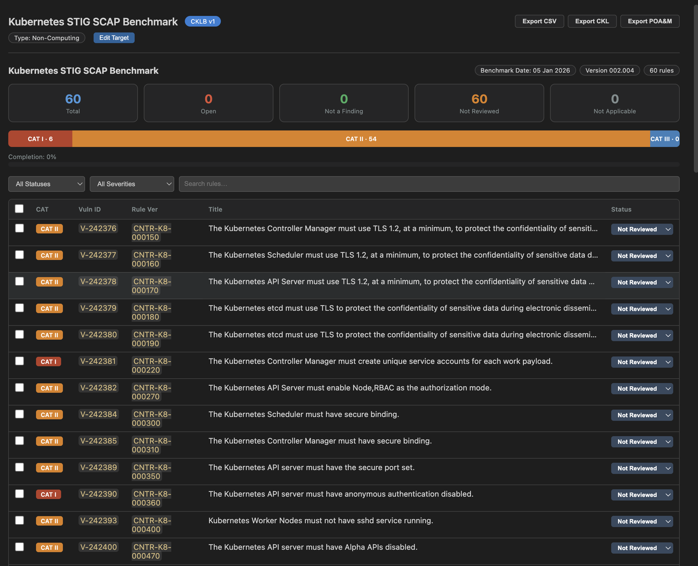

# STIG Workbench — VSCode Extension

A Visual Studio Code extension for viewing, editing, importing, and exporting DISA STIG Checklist files (`.cklb` format) with a rich, interactive overview panel. Built for security assessors, ISSMs, and compliance teams working with STIGs daily.



## Free vs Pro

The extension is **free** for the core checklist workflow: open and edit `.cklb` files, import benchmarks from standalone **XCCDF**, **SCAP 1.2/1.3** benchmark data streams, or legacy **CKL**, and **export to CKL** for eMASS.

**Pro** unlocks integrations, automation, advanced reporting exports, and bundled deliverables. Use **STIG Workbench: Enter License Key** to activate ([www.stigworkbench.com](https://www.stigworkbench.com)).

| Capability | Free | Pro |
| --- | :---: | :---: |
| `.cklb` viewer & editor (stats, filters, detail panel, inline edit, bulk status, target data, undo/redo) | ✓ | |
| Import benchmark (standalone **XCCDF** or **SCAP 1.2/1.3** data stream) → `.cklb` | ✓ | |
| Import legacy **CKL** → `.cklb` | ✓ | |
| **Export CKL** (eMASS / STIG Viewer–compatible XML) | ✓ | |
| Import **SCAP** XCCDF results | | ✓ |
| **Export summary CSV** | | ✓ |
| **Export POA&M** CSV | | ✓ |
| Multi-checklist **dashboard** | | ✓ |
| **Merge / carry forward** findings between STIG versions | | ✓ |
| **Diff** two checklists | | ✓ |
| **SARIF** import (CWE mapping) | | ✓ |
| **Dependency audit** import (npm / pip / bundler JSON) | | ✓ |
| **Repo scanner** (regex patterns) | | ✓ |
| **Evidence package** (zip bundle) | | ✓ |

Commands **STIG Workbench: Enter License Key**, **License Status**, and **Remove License Key** are available on every tier.

## Features

### Checklist Viewer & Editor (Free)

- **Auto-opens `.cklb` files** with a custom editor — double-click any `.cklb` file
- **File icon** — `.cklb` files display a blue shield icon in the explorer
- **Stat cards** — Open / Not a Finding / Not Reviewed / Not Applicable counts at a glance
- **Severity bar** — proportional CAT I / CAT II / CAT III breakdown
- **Completion tracker** — progress bar showing evaluation progress
- **Filterable rule table** — filter by status, severity, or free-text search
- **Column sorting** — click any table header to sort ascending/descending
- **Detail slide-over** — click a rule to see full Discussion, Check Content, Fix Text, and edit findings
- **Keyboard navigation** — Arrow keys / j/k to move through rows, Enter to open detail, Escape to close
- **Respects VS Code themes** — uses CSS variables for dark, light, and high-contrast themes

### Inline Editing (Free)

- **Inline status dropdown** — change a rule's status directly from the table without opening the detail panel
- **Auto-save** — status changes, finding details, and comments save automatically (no manual Save button click required)
- **Bulk status updates** — select multiple rules with checkboxes, set them all to the same status at once with an optional shared comment
- **Target data editing** — click "Edit Target" to set host name, IP, FQDN, MAC, role, and other asset info
- **Undo/redo support** — Ctrl+Z / Cmd+Z works naturally, syncing the webview with VS Code's undo stack
- **Finding details templates** — dropdown with common assessment phrases (Compliant, N/A, Open, Screenshot evidence, Inherited control) that insert at the cursor

### Import & Export

- **(Free) Import XCCDF Benchmark** — generate a blank `.cklb` checklist from DISA STIG benchmark XML. Right-click any supported `.xml` in the explorer or run the command from the palette. Supported inputs:
  - **Standalone XCCDF** — files named like `*-xccdf.xml` with a root `<Benchmark>` element (classic DISA layout).
  - **SCAP data stream** — SCAP **1.2** or **1.3** bundles (often `*Benchmark*.xml` or `*SCAP*Benchmark*.xml`) whose root is `<data-stream-collection>`; the extension finds the embedded XCCDF `<Benchmark>` inside the checklist component.
- **(Free) Import CKL (legacy)** — convert older `.ckl` XML checklists to `.cklb` format, preserving all statuses, findings, and comments
- **(Pro) Import SCAP scan results** — parse XCCDF results files from automated SCAP scans and auto-populate rule statuses (pass/fail/error mapped to the correct checklist statuses)
- **(Free) Export to CKL** — generate a DISA STIG Workbench 2.x compatible `.ckl` XML file for eMASS submission
- **(Pro) Export summary CSV** — full checklist data with Vuln ID, severity, status, finding details, comments, CCIs
- **(Pro) Export POA&M** — auto-generate a Plan of Action & Milestones CSV from all Open findings with standard DOD columns (weakness, POC, scheduled completion, milestones, status)

### Multi-Checklist Dashboard (Pro)

- **Aggregate view** — open the dashboard to see stats across all `.cklb` files in your workspace
- **Per-checklist breakdown** — table showing host, STIG name, total/open/NaF/NR/NA counts, and completion percentage for each checklist
- **Click to open** — click any row in the dashboard to open that checklist in the viewer
- **Sortable columns** — sort the dashboard table by any column
- **Refresh** — re-scan the workspace for new or changed checklists

### Merge & Compare (Pro)

- **Carry forward findings** — when a new STIG version drops, merge your completed findings from the old checklist into the new one. Matches rules by `rule_version` (the most stable identifier across STIG releases). Reports how many carried forward, how many are new, how many were removed
- **Diff two checklists** — side-by-side comparison showing status regressions, improvements, new rules, and removed rules. Color-coded with regressions sorted first. Toggle to show/hide unchanged rules

### SAST & Security Tool Integration (Pro)

- **SARIF import with CWE-to-STIG mapping** — import SARIF output from any SAST tool (CodeQL, Semgrep, ESLint security, Bandit, SpotBugs) and auto-map findings to ASD STIG rules via a built-in CWE mapping table covering 50+ CWEs across OWASP Top 10, buffer overflows (V-70277), race conditions (V-70185), and error handling (V-70391). Findings include file paths, line numbers, and CWE descriptions
- **Dependency audit import** — import `npm audit --json`, `pip-audit --format json`, or `bundler-audit` output to auto-populate dependency/third-party component STIG rules. Auto-detects the audit format
- **Repo scanner** — built-in regex-based scanner with 15+ configurable patterns for hardcoded secrets, SQL injection, XSS, command injection, insecure crypto, debug mode, and more. Bring your own `scan-patterns.json` to customize
- **SCAP results import** — parse XCCDF results files from automated SCAP scans and auto-populate rule statuses

### Evidence & Deliverables (Pro)

- **Evidence package builder** — export a complete ATO evidence zip containing: the `.cklb` checklist, `.ckl` XML export, summary CSV, POA&M CSV, a text summary report, and optionally attached screenshots or scan reports

**From the checklist toolbar:** **Export CKL** is free; **Export CSV** and **Export POA&M** require Pro.

## Commands

All commands are available from the Command Palette (`Cmd+Shift+P` / `Ctrl+Shift+P`):

| Command | Tier | Description |
| ------- | ---- | ----------- |
| `STIG Workbench: Open .cklb File` | Free | Open a `.cklb` file via file picker |
| `STIG Workbench: Import XCCDF Benchmark` | Free | Generate a blank `.cklb` from standalone XCCDF or an SCAP 1.2/1.3 benchmark data stream |
| `STIG Workbench: Import CKL Checklist` | Free | Convert a legacy `.ckl` to `.cklb` |
| `STIG Workbench: Import SCAP Scan Results` | Pro | Apply SCAP scan results to a checklist |
| `STIG Workbench: Merge / Carry Forward Findings` | Pro | Copy findings from an old checklist to a new one |
| `STIG Workbench: Diff Two Checklists` | Pro | Compare two checklists side-by-side |
| `STIG Workbench: Open Dashboard` | Pro | Aggregate stats across all workspace checklists |
| `STIG Workbench: Import SARIF Results` | Pro | Map SAST findings to STIG rules via CWE |
| `STIG Workbench: Import Dependency Audit` | Pro | Import npm audit / pip-audit JSON |
| `STIG Workbench: Scan Repo Against Checklist` | Pro | Run built-in regex scanner on a codebase |
| `STIG Workbench: Export Evidence Package` | Pro | Bundle checklist + exports + evidence into a zip |
| `STIG Workbench: Enter License Key` | — | Store and validate a Pro license |
| `STIG Workbench: License Status` | — | Show whether Pro is active |
| `STIG Workbench: Remove License Key` | — | Clear the stored license |

**Context menus:**

- Right-click any `.xml` file (including SCAP benchmark bundles) → **STIG Workbench: Import XCCDF Benchmark**
- Right-click any `.ckl` file → **STIG Workbench: Import CKL Checklist**

## Installation

### From VSIX

```bash
npm install -g @vscode/vsce
cd stig-viewer-vscode
npm install
vsce package
code --install-extension stig-viewer-*.vsix
```

### Development

```bash
cd stig-viewer-vscode
npm install
npm run compile
code .
```

Press **F5** to launch an Extension Development Host. Open the included `samples/example.cklb` to test.

## Typical Workflows

### Starting a new assessment

1. Download the STIG benchmark from [public.cyber.mil](https://public.cyber.mil/stigs/)
2. Run `STIG Workbench: Import XCCDF Benchmark` and select the benchmark XML — either a standalone `*-xccdf.xml` file or an **SCAP 1.2/1.3** package such as `U_*_STIG_SCAP_1-3_Benchmark.xml` (data stream with embedded XCCDF).
3. A blank `.cklb` is written next to the source file and opens automatically
4. Click "Edit Target" to fill in host name, IP, FQDN, and other asset info
5. Work through rules — use inline status dropdowns for quick triage, detail panel for findings

### Updating to a new STIG version (Pro)

1. Import the new XCCDF benchmark to generate a blank `.cklb`
2. Run `STIG Workbench: Merge / Carry Forward Findings` (Pro)
3. Select your old completed checklist, then the new blank one
4. Review the merge report — carry-forward count, new rules, removed rules

### Importing legacy checklists

1. Right-click a `.ckl` file → `STIG Workbench: Import CKL Checklist`
2. The converted `.cklb` opens with all statuses and findings preserved

### Applying SCAP scan results (Pro)

1. Run your SCAP scan and save the XCCDF results file
2. Run `STIG Workbench: Import SCAP Scan Results`
3. Select your `.cklb` checklist, then the results XML
4. Automated results are applied — review and supplement with manual checks

### Automated ASD STIG assessment with SAST tools (Pro)

1. Import the ASD STIG XCCDF benchmark to create a blank `.cklb`
2. Run your SAST tool and export results as SARIF:
   - CodeQL: `codeql database analyze --format=sarif-latest`
   - Semgrep: `semgrep --sarif -o results.sarif`
   - Bandit: `bandit -r . -f sarif -o results.sarif`
   - ESLint: `eslint --format @microsoft/eslint-formatter-sarif -o results.sarif`
3. Run `STIG Workbench: Import SARIF Results` — select your checklist and SARIF file(s)
4. Findings are auto-mapped to STIG rules via CWE IDs with file/line evidence
5. Run `npm audit --json > audit.json` and import with `STIG Workbench: Import Dependency Audit`
6. Use the repo scanner for additional pattern checks: `STIG Workbench: Scan Repo Against Checklist`
7. Review remaining `Not Reviewed` rules manually
8. Export the evidence package: `STIG Workbench: Export Evidence Package`

### Generating deliverables

- **For eMASS (Free)**: click **Export CKL** to generate a `.ckl` XML file
- **For briefings (Pro)**: click **Export CSV** for a full summary spreadsheet
- **For POA&Ms (Pro)**: click **Export POA&M** to generate a CSV of all Open findings with standard DOD columns

## How the .cklb Format Works

A `.cklb` file is JSON with this structure:

```json
{
  "title": "Checklist Title",
  "id": "uuid",
  "cklb_version": "1",
  "target_data": { "host_name": "", "ip_address": "", "fqdn": "" },
  "stigs": [
    {
      "stig_name": "Full STIG Name",
      "display_name": "Short Name",
      "release_info": "Release: 1 Benchmark Date: ...",
      "rules": [
        {
          "group_id": "V-233511",
          "rule_version": "CD12-00-000100",
          "severity": "high",
          "status": "not_reviewed",
          "rule_title": "...",
          "discussion": "...",
          "check_content": "...",
          "fix_text": "...",
          "finding_details": "...",
          "comments": "...",
          "ccis": ["CCI-000382"]
        }
      ]
    }
  ]
}
```

| Term | Meaning |
| ---- | ------- |
| CAT I | High severity — most critical |
| CAT II | Medium severity — bulk of most STIGs |
| CAT III | Low severity — less urgent |
| Open | System fails this check |
| Not a Finding | System passes this check |
| Not Reviewed | Not yet evaluated |
| Not Applicable | Rule doesn't apply to this system |
| CCI | Control Correlation Identifier — maps to NIST 800-53 |
| SRG | Security Requirements Guide — the parent requirement |

## Architecture

```text
src/
  extension.ts            # Activation, command registration
  types.ts                # TypeScript interfaces for .cklb schema
  cklbEditorProvider.ts   # Custom editor (parse, render, save, export)
  webviewContent.ts       # HTML/CSS/JS builder for the checklist webview
  dashboardPanel.ts       # Multi-checklist dashboard webview
  diffPanel.ts            # Checklist diff comparison webview
  xccdfImporter.ts        # Standalone XCCDF + SCAP data-stream benchmark → .cklb import
  importCkl.ts            # Legacy .ckl → .cklb import
  importScapResults.ts    # SCAP XCCDF results → .cklb import
  mergeFindings.ts        # Carry forward findings between checklist versions
  exportCkl.ts            # .cklb → .ckl XML export
  exportCsv.ts            # .cklb → summary CSV export
  exportPoam.ts           # .cklb → POA&M CSV export
  importSarif.ts          # SARIF → .cklb with CWE-to-STIG mapping
  importAudit.ts          # npm audit / pip-audit → .cklb
  cweStigMap.ts           # CWE ID → STIG rule keyword mapping table
  repoScanner.ts          # Regex-based repo scanner
  evidencePackage.ts      # Evidence zip builder
```

The extension uses VS Code's **Custom Text Editor API**. The `.cklb` file stays a text document — status changes write back via `WorkspaceEdit`, so Cmd+S / Ctrl+S and undo/redo work naturally.

## License

MIT
